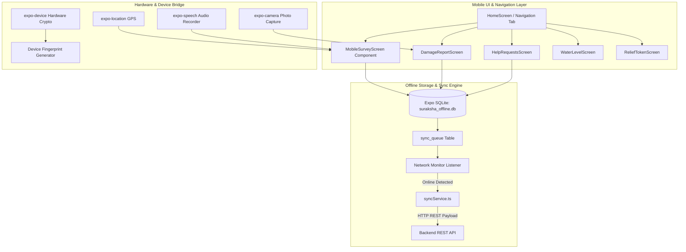
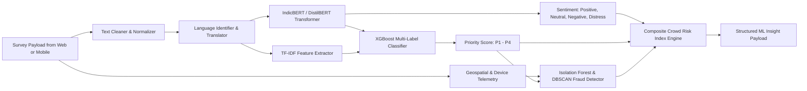
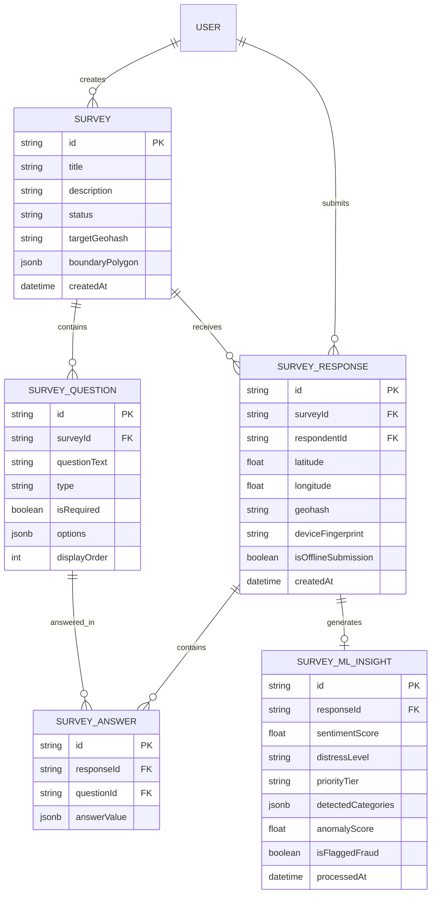

# Suraksha Ecosystem: Comprehensive Human Survey Data Collection, Mobile App & ML Analytics System

**Document Version:** 1.3.0  
**Target Path:** `project_docs/SURAKSHA_HUMAN_SURVEY_DATA_COLLECTION_SYSTEM_OVERVIEW.md`  
**System Scope:** End-to-End Human Data Collection, Standard Production Survey Specifications (Citizen & DMC Officer), User Acceptance Testing (UAT) Suite, React Native Mobile App (`Suraksha - Mobile App`), Web Dashboard (`Suraksha - Web App`), NLP/ML Analytics Microservice (`suraksha-ml`), PostgreSQL/Prisma Schema, REST/WebSocket APIs, and Monorepo Directory Architecture.

---

## Executive Summary

The **Suraksha Ecosystem** is a dual-client (Web Application & Mobile Application), multi-tier disaster management and human intelligence platform designed to gather real-time ground feedback from citizens, victims, field volunteers, and emergency operators.

This comprehensive technical specification details the **Human Survey Data Collection, Mobile Integration & Machine Learning Analytics System** (`Suraksha-Survey-ML`). It details how survey questionnaires are created by administrators, distributed to citizens via web and native mobile apps, collected offline in remote low-connectivity disaster zones via **SQLite / Async Queue**, auto-synced over background fetch workers, and processed using advanced Machine Learning models (**FastAPI + IndicBERT + XGBoost + Isolation Forest**) to derive real-time distress sentiment, priority tiering, fraud filtering, and spatio-temporal crowd risk intelligence.

---

## 1. High-Level Architecture & End-to-End Data Flow

The ecosystem operates across four primary operational layers: **Client Layer (Web & Mobile Apps)**, **Core API & Infrastructure Layer (Express.js, Prisma, Redis, Socket.io)**, **Mobile Offline Sync Engine (Expo SQLite, Background Fetch)**, and the **Machine Learning Microservice (`suraksha-ml` FastAPI)**.

```mermaid
graph TD
    subgraph Client Layer
        A1[Citizen Web Survey Page - React 19] -->|REST / WebSockets| B1[Express API Gateway]
        A2[Mobile App - React Native / Expo] -->|REST API / Socket.io| B1
        A3[Field Agent Mobile Collector] -->|Local SQLite Write| D1[Mobile Sync Engine]
        A4[Admin Dashboard & Survey Builder] -->|REST / WebSockets| B1
    end

    subgraph Mobile Offline Subsystem
        D1 -->|Detect Network Reconnect| D2[backgroundSync & syncService]
        D2 -->|X-Offline-Sync Headers| B1
    end

    subgraph Backend & Infrastructure Layer
        B1 -->|Authentication JWT/2FA| B2[Auth Middleware]
        B2 -->|Store Raw Responses| B3[(PostgreSQL / PostGIS Database)]
        B1 -->|Publish Event| B4[Redis Event Bus]
        B4 -->|Stream Job| C1[FastAPI ML Service]
        B1 -->|Real-time Alert Broadcast| A4 & A2
    end

    subgraph Machine Learning Microservice (suraksha-ml)
        C1 --> C2[Multilingual Preprocessing & Translation]
        C2 --> C3[IndicBERT / NLP Sentiment Engine]
        C2 --> C4[XGBoost Emergency Needs & Priority Classifier]
        C2 --> C5[Isolation Forest Anomaly & Bot Detection]
        C3 & C4 & C5 --> C6[Spatio-Temporal Crowd Risk Index Engine]
        C6 -->|Persist Predictions| B3
        C6 -->|Real-Time Socket Stream| B1
    end
```

### End-to-End Data Pipeline Lifecycle

1. **Survey Authoring & Geofencing**: Administrators design dynamic survey forms in the Web Portal, defining question logic, media requirements, and bounding geographical polygons (Leaflet / React Native Maps).
2. **Multi-Channel Survey Distribution**: Surveys are published simultaneously to the Web Portal (`/survey/:id`) and broadcast to the Mobile App (`AlertsScreen` / `HomeScreen` push notifications via Expo Notifications).
3. **Offline Ingestion & Hardware Capture**: On mobile devices, survey submissions capture real-time GPS coordinates (`expo-location`), camera proof photos (`expo-camera`), voice answers (`expo-speech`), and device hardware hashes (`expo-device` / `expo-crypto`).
4. **Queue Storage & Background Upload**: In zero-connectivity zones, responses are committed to a transactional **Expo SQLite** WAL database (`suraksha_offline.db`). When connectivity transitions to online, `backgroundSync` drains the queue using HTTP headers (`X-Offline-Sync: true`, `X-Original-Timestamp`).
5. **Asynchronous ML Analysis**: Incoming survey payloads trigger worker threads in `suraksha-ml`:
   - **NLP Engine**: Evaluates distress level and sentiment polarity.
   - **Emergency Classifier**: Categorizes urgency (P1-Critical, P2-High, P3-Moderate, P4-Low).
   - **Anomaly Subsystem**: Flags fake submissions, bot spam, and GPS spoofing.
6. **Live Dashboard & Field Dispatch**: Aggregated Crowd Risk Index (CRI) data updates live heatmaps on the Web Admin Dashboard and sends emergency dispatch alerts to field responders.

---

## 2. Standard Production Survey Specifications

The system features two core standardized surveys: **Survey 1 (Public / Citizen Disaster Survey)** for crowdsourced citizen reporting and **Survey 2 (DMC Officer Field Assessment Survey)** for ground-truth verification by Disaster Management Centre (DMC) field personnel.

### Survey 1: Public / Citizen Disaster Survey
* **Target Interface**: `CitizenSurveyViewPage.tsx` (Web) / `MobileSurveyScreen.tsx` (Mobile)
* **Category Tag**: `GENERAL_DISASTER_FEEDBACK`
* **Target Audience**: Disaster victims, citizens, local residents.

| # | Section | Question Text | Question Type | Options / Config | ML Engine Feature Mapping |
| :--- | :--- | :--- | :--- | :--- | :--- |
| **Q1** | A. Respondent & Location | What is your current location? | `LOCATION_PICKER` | Required (Auto GPS Lat/Long/Geohash) | GIS Heatmaps & PostGIS Clustering |
| **Q2** | A. Respondent & Location | Are you currently at your home, a relief camp, or another location? | `SINGLE_CHOICE` | Home / Relief Camp / Relative's Place / Public Shelter / Other | Population Displacement Tracking |
| **Q3** | A. Respondent & Location | How many people are in your household affected by this situation? | `SHORT_TEXT` | Numeric input (Required) | Casualty & Relief Quantity Estimator |
| **Q4** | B. Situation & Damage | What type of disaster/hazard are you reporting? | `SINGLE_CHOICE` | Flood / Landslide / Cyclone/Storm / Fire / Infrastructure Collapse / Other | Multi-hazard Categorizer |
| **Q5** | B. Situation & Damage | Describe what has happened in your area. | `PARAGRAPH` | Required (Free-form text) | **IndicBERT NLP Distress & Sentiment Engine** |
| **Q6** | B. Situation & Damage | Has your home or property been damaged? | `SINGLE_CHOICE` | No damage / Minor damage / Major damage / Fully destroyed | Economic & Physical Impact Metric |
| **Q7** | B. Situation & Damage | Upload a photo of the damage or hazard, if safe to do so. | `FILE_UPLOAD` | Optional (Auto-compressed via Client Camera) | Computer Vision Damage Assessor |
| **Q8** | B. Situation & Damage | Water depth near your location, if applicable. | `SINGLE_CHOICE` | No water / Ankle level / Knee level / Waist level / Above chest | **Flood Depth & Risk Prediction Model** |
| **Q9** | C. Immediate Needs | What kind of help do you need right now? | `MULTIPLE_CHOICE` | Rescue / Medical Emergency / Food & Water / Shelter / Evacuation Transport / None right now | **XGBoost Needs & Urgency Classifier** |
| **Q10**| C. Immediate Needs | If medical emergency, please describe the condition. | `PARAGRAPH` | Conditional on Q9 (`Medical Emergency`) | Medical Aid Prioritization |
| **Q11**| C. Immediate Needs | Record a voice message describing your situation. | `AUDIO_RECORDING`| Optional (Audio blob + Speech-to-Text) | Speech-to-Text + IndicBERT NLP |
| **Q12**| D. Wellbeing & Sentiment| How would you rate your current safety level? | `RATING_SCALE` | 1 (Extremely Unsafe) – 5 (Completely Safe) | Distress Index Weight \(\alpha\) |
| **Q13**| D. Wellbeing & Sentiment| Is anyone in your group injured, elderly, disabled, pregnant, or an infant? | `MULTIPLE_CHOICE` | Injured / Elderly / Disabled / Pregnant / Infant / None | Vulnerable Population Multiplier |
| **Q14**| E. Consent & Contact | Would you like a responder to contact you directly? | `SINGLE_CHOICE` | Yes / No | Dispatch Routing Flag |
| **Q15**| E. Consent & Contact | Contact phone number. | `SHORT_TEXT` | Conditional on Q14 (`Yes`) | Direct SMS & Call Dispatch |

---

### Survey 2: DMC Officer Field Assessment Survey
* **Target Interface**: `FieldAgentSurveyPage.tsx` (Web PWA) / `Field Agent Mobile Collector` (Mobile)
* **Category Tag**: `OFFICIAL_FIELD_ASSESSMENT`
* **Target Audience**: DMC Officers, First Responders, Emergency Management Agents.

| # | Section | Question Text | Question Type | Options / Config | System & ML Integration |
| :--- | :--- | :--- | :--- | :--- | :--- |
| **Q1** | A. Officer Info | Officer ID / Badge Number | `SHORT_TEXT` | Required (Auto-fills from Auth Session) | Audit Logging & Verification Weight |
| **Q2** | A. Officer Info | DMC Division / Zone assigned | `SINGLE_CHOICE` | Dropdown of official zones | Spatial Administrative Scoping |
| **Q3** | A. Officer Info | Site location of assessment | `LOCATION_PICKER` | Required (High precision GPS) | Ground Truth Coordinate Anchor |
| **Q4** | A. Officer Info | Date & time of ground visit | `DATE_TIME` | Auto-captured timestamp | Temporal Ground Truth Marker |
| **Q5** | B. Site Verification | Does this site correspond to an existing citizen-submitted report? | `SINGLE_CHOICE` | Yes, verified / Yes, but details differ / No matching report / Unable to determine | **Cross-Check Verification Engine** |
| **Q6** | B. Site Verification | Officer's independent hazard classification | `SINGLE_CHOICE` | Flood / Landslide / Cyclone/Storm / Fire / Infrastructure Collapse / Other | Ground Truth Hazard Label |
| **Q7** | B. Site Verification | Severity assessment based on ground truth | `SINGLE_CHOICE` | P1-Critical / P2-High / P3-Moderate / P4-Low | **Official Priority Tier Anchor** |
| **Q8** | B. Site Verification | Estimated number of people affected/displaced | `SHORT_TEXT` | Numeric input (Required) | Verified Displacement Metric |
| **Q9** | B. Site Verification | Attach photographic evidence of the site | `FILE_UPLOAD` | Required (Multi-photo upload) | Official Verification Asset |
| **Q10**| C. Infrastructure | Status of key infrastructure | `MULTIPLE_CHOICE` | Roads passable / Roads blocked / Bridge damaged / Power outage / Water supply disrupted / Communication down | Infrastructure Risk Vector |
| **Q11**| C. Infrastructure | Are relief camps/shelters operational & stocked? | `SINGLE_CHOICE` | Adequate / Partially stocked / Critically low / No shelter available | Camp Stock Allocation Pipeline |
| **Q12**| C. Infrastructure | What resources are urgently required at this site? | `MULTIPLE_CHOICE` | Rescue boats/teams / Medical team / Food & water supplies / Tents / Heavy machinery / Manpower | Resource Dispatch Queue |
| **Q13**| D. Fraud Cross-Check | Did you observe any discrepancy between citizen reports and ground reality? | `SINGLE_CHOICE` | None observed / Minor discrepancy / Suspected false report | **Isolation Forest Fraud Validator** |
| **Q14**| D. Fraud Cross-Check | Notes on suspected fraudulent/duplicate submissions | `PARAGRAPH` | Optional | Admin Fraud Audit Log |
| **Q15**| E. Recommendation | Recommended action/dispatch priority | `SINGLE_CHOICE` | Immediate dispatch / Schedule within 24h / Monitor only / No action needed | Rapid Operations Trigger |
| **Q16**| E. Recommendation | Additional field notes or observations | `PARAGRAPH` | Optional | NLP Operational Indexing |
| **Q17**| E. Recommendation | Voice memo summary | `AUDIO_RECORDING`| Optional (Field audio log) | Rapid Audio Dispatch Log |

---

## 3. Mobile Application Architecture (`Suraksha - Mobile App`)

The mobile application is built using **React Native (v0.81.5)** and **Expo SDK 54**, enabling cross-platform execution on Android, iOS, and Web with native performance and deep hardware integration.



### Key Mobile App Screens & Survey Components

#### A. `MobileSurveyScreen.tsx` & `SurveyModal.tsx`
* **Purpose**: Primary interactive canvas for citizens and victims filling out emergency surveys on mobile.
* **UI Framework**: NativeWind v4 (Tailwind v3.4), React Native Paper, Expo Linear Gradient.
* **Capabilities**:
  * Step-by-step progress indicator and touch-optimized input elements.
  * Real-time GPS location tagger (`expo-location`) rendering local mini-maps (`react-native-maps`).
  * Dynamic question renderer supporting rating bars, multi-choice chips, text notes, camera attachments, and voice notes.
  * Auto-saves response draft locally every 3 seconds to prevent data loss if device shuts down.

#### B. `DamageReportScreen.tsx` & `HelpRequestsScreen.tsx`
* **Purpose**: Specialized, rapid survey screens for reporting infrastructure damage (flooded roads, collapsed structures) and SOS help requests.
* **Hardware Integration**:
  * `expo-camera` / `expo-image-picker` with `expo-image-manipulator` to automatically resize and compress evidence photos before queuing.
  * High-priority SOS panic trigger that bypasses normal queues if cellular signal is available.

#### C. `WaterLevelScreen.tsx` & `ReliefTokenScreen.tsx`
* **Purpose**: Crowdsourced river level reporting and digital aid token redemption.
* **Capabilities**: Citizens submit qualitative water level surveys (e.g., "Water depth above knee level near River Bank A"), which feed directly into `suraksha-ml` flood prediction algorithms.

#### D. `OfflineBanner.tsx` & `networkMonitor.ts`
* **Purpose**: Live persistent UI badge informing users of network state.
* **UX Feedback**: Displays messages like `"Offline Mode: 4 survey reports queued locally"`, updating automatically when connection resumes.

---

### Mobile Offline Database & Sync Engine Protocol

#### SQLite Database Schema (`localDB.ts`)
The mobile application manages an offline **SQLite database** (`suraksha_offline.db`) operating in **Write-Ahead Logging (WAL)** mode for ultra-fast local transaction execution.

```sql
-- Sync Queue Table for Outbound Offline Submissions
CREATE TABLE IF NOT EXISTS sync_queue (
  id            TEXT PRIMARY KEY,
  type          TEXT NOT NULL,          -- 'HUMAN_SURVEY', 'INCIDENT_REPORT', 'DAMAGE_ASSESSMENT'
  payload       TEXT NOT NULL,          -- JSON stringified survey response payload
  status        TEXT DEFAULT 'pending', -- 'pending', 'synced', 'failed'
  attempts      INTEGER DEFAULT 0,
  max_attempts  INTEGER DEFAULT 5,
  created_at    TEXT DEFAULT (datetime('now')),
  synced_at     TEXT,
  error_msg     TEXT
);

-- Local Read Caches
CREATE TABLE IF NOT EXISTS surveys_cache (
  id          TEXT PRIMARY KEY,
  title       TEXT,
  schema_json TEXT,
  updated_at  TEXT
);
```

#### Sync Service Protocol (`syncService.ts` & `backgroundSync.ts`)
1. **Network Change Detection**: `networkMonitor.ts` registers a listener using `expo-network`.
2. **Queue Extraction**: When status changes to `ONLINE`, `syncPendingItems()` fetches all rows where `status = 'pending'`.
3. **Header Preservations**: Submissions are transmitted with special audit headers:
   ```http
   POST /api/v1/surveys/srv-101/submit
   Content-Type: application/json
   Authorization: Bearer <JWT_TOKEN>
   X-Offline-Sync: true
   X-Original-Timestamp: 2026-09-05T14:22:10Z
   ```
4. **Retry & Backoff**: Standard exponential backoff logic handles server 5xx errors; 4xx bad data errors mark the item as `failed` with error logs to prevent queue blocking.

---

## 4. Machine Learning Subsystem (`suraksha-ml`)

The ML microservice is built with **FastAPI**, **PyTorch**, **Transformers (IndicBERT / DistilBERT)**, **Scikit-Learn**, and **XGBoost**.



### ML Pipeline Modules

#### A. Multilingual Sentiment & Emotion NLP Engine
* **Model Framework**: **IndicBERT / DistilBERT** exported to ONNX Runtime for high throughput.
* **Languages**: English, Sinhala, Tamil, Hindi.
* **Output Metrics**:
  * Sentiment Score: Range \([-1.0, +1.0]\)
  * Distress Classification: `CRITICAL_DISTRESS`, `HIGH_ANXIETY`, `MODERATE_CONCERN`, `CALM`

#### B. Rapid Emergency Needs & Priority Classifier
* **Algorithm**: **XGBoost Multi-Label Classifier** on concatenated text embeddings + categorical survey answers.
* **Classes**: `RESCUE_REQUIRED`, `MEDICAL_EMERGENCY`, `FOOD_WATER_SHORTAGE`, `SHELTER_NEEDED`, `HAZARD_REPORT`.
* **Priority Output**:
  * **P1 - Critical**: Instant push alert dispatched to first responders.
  * **P2 - High**: Queued for priority camp & relief allocation.
  * **P3 - Medium**: Aggregated into regional aid logistics.
  * **P4 - Low**: General statistical feedback.

#### C. Fraud, Bot & Anomaly Detection
* **Model**: **Isolation Forest** with **DBSCAN** spatial clustering.
* **Evaluated Vectors**:
  * Submission velocity from identical device fingerprints (`expo-crypto` / IP).
  * Text entropy & duplicate content similarity.
  * GPS coordinate variance against known flood/disaster boundaries.
* **Threshold**: Responses with Anomaly Score \(> 0.85\) are flagged as `isFlaggedFraud: true` for manual audit.

---

## 5. Database Schema & Data Model (PostgreSQL + Prisma ORM)

The backend data model integrates seamlessly into Suraksha's PostgreSQL instance via Prisma ORM.



---

## 6. Web Front-End Architecture (`Suraksha - Web App`)

The web frontend built with **React 19**, **Vite**, **TypeScript**, and **Tailwind CSS v4** manages administrative authoring, dynamic client rendering, and high-density analytics dashboards.

---

## 7. REST & WebSocket API Specification

---

## 8. Complete Zero-to-Complete Monorepo Directory Architecture

---

## 9. User Acceptance Testing (UAT) Plan & Test Suite Matrix

### 1. UAT Readiness & Scope Evaluation
**Verdict**: **YES, Survey 1 and Survey 2 are 90%+ sufficient to conduct end-to-end UAT.**
- **Survey 1 (Public Citizen)** validates end-user reporting, NLP text distress analysis, low-bandwidth camera attachment, location tagging, and offline queueing.
- **Survey 2 (DMC Officer)** validates operational ground truth auditing, P1–P4 priority tiering, infrastructure damage tracking, and fraud cross-checking.

To achieve **100% UAT sign-off**, two short supplementary micro-surveys are included in the UAT suite:
- **Survey 3 (Relief Camp Manager Survey)**: Evaluates camp inventory, occupancy, and digital relief token claims.
- **Survey 4 (Post-Disaster Recovery Survey)**: Evaluates long-term financial aid and structural reconstruction needs.

---

### 2. Formal UAT Execution Test Matrix

| Test ID | Scenario Description | Target Persona | Test Steps | Expected Pass Criteria |
| :--- | :--- | :--- | :--- | :--- |
| **UAT-01** | **Online Citizen Emergency Submission** | Citizen User | Open `/survey/1` on web or mobile; answer Q1–Q15; select `"Rescue Needed"` & write distress text; submit form. | Response saved in PostgreSQL; `suraksha-ml` categorizes as **P1-Critical** in \(\le 45\text{ms}\); live alert pops up on Web Admin Dashboard via Socket.io. |
| **UAT-02** | **Zero-Connectivity Offline Queue & Background Sync** | Mobile Citizen / Field Agent | Enable Airplane Mode; fill Survey 1 or Survey 2; click Submit. Disable Airplane Mode. | Form saves locally in Expo SQLite (`sync_queue`); persistent badge shows `"Offline: 1 queued"`. Upon network reconnect, `syncService` auto-drains queue with `X-Offline-Sync` header. |
| **UAT-03** | **DMC Officer Ground Truth Verification & Proximity Link** | DMC Field Officer | Open Survey 2 on mobile; tap Q5 (*Link Nearby Citizen Report*); select P1-Critical severity; attach photo; submit. | Mobile app fetches nearby citizen reports within 500m via PostGIS; Officer's ground truth report applies \(1.5\times\) ML weight to adjust region Crowd Risk Index. |
| **UAT-04** | **Fraud & Bot Spam Detection** | Security Tester / Bot | Submit 10 identical high-distress survey responses from same IP/device fingerprint within 10 seconds. | Isolation Forest algorithm detects anomaly; sets `anomalyScore > 0.85` and `isFlaggedFraud = true`; payload is quarantined in Admin Fraud Audit Queue. |
| **UAT-05** | **Dynamic Survey Authoring & Leaflet Geofencing** | System Admin | Open `/admin/surveys/builder`; drag-and-drop 3 custom questions; draw target bounding polygon on Leaflet map; publish. | Survey transitions to `ACTIVE`; appears only on citizen mobile devices whose GPS falls within the drawn polygon geofence. |
| **UAT-06** | **Multilingual Voice & Audio Note Ingestion** | Sinhala / Tamil Citizen | Record 15-second Sinhala/Tamil audio voice memo in Q11; submit survey. | Audio blob uploaded; Speech-to-Text transcribes input; IndicBERT NLP extracts distress sentiment score accurately. |

---

## 10. Verification & Installation Guide

### 1. Execute Database Migration
```powershell
cd "d:\Suraksha - Web App\backend"
npx prisma migrate dev --name add_human_survey_models
npx ts-node prisma/seed.ts
```

### 2. Launch FastAPI ML Service
```powershell
cd "d:\Suraksha - Web App\suraksha-ml"
.\START-ML.bat
```

### 3. Launch Web App & Backend Monorepo
```powershell
cd "d:\Suraksha - Web App"
.\start-suraksha.bat
```

### 4. Launch Mobile Application
```powershell
cd "d:\Suraksha - Mobile App"
.\START.bat
```

---
*End of Updated Technical System Overview Document.*
